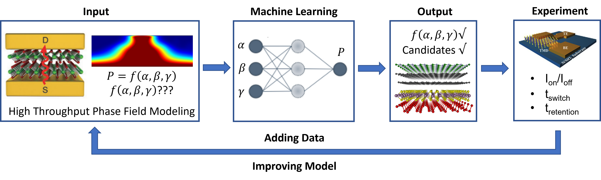

# MSE_593_Project
Project for MSE 593 Data-Driven Materials Design and Genomics
Project: 2D materials as memristor candidates using high throughput phase field simulations and machine learning

The proposed research seeks to accelerate the rate of identifying suitable 2D materials for RRAM devices by developing high-throughput simulations. Using machine learning techniques to interpret the data can aid in understanding the important material parameters that influence resistive switching in the devices.

